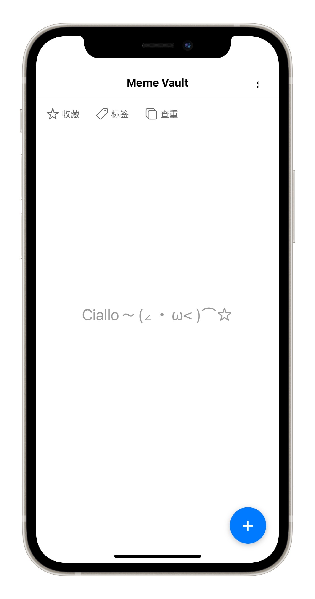
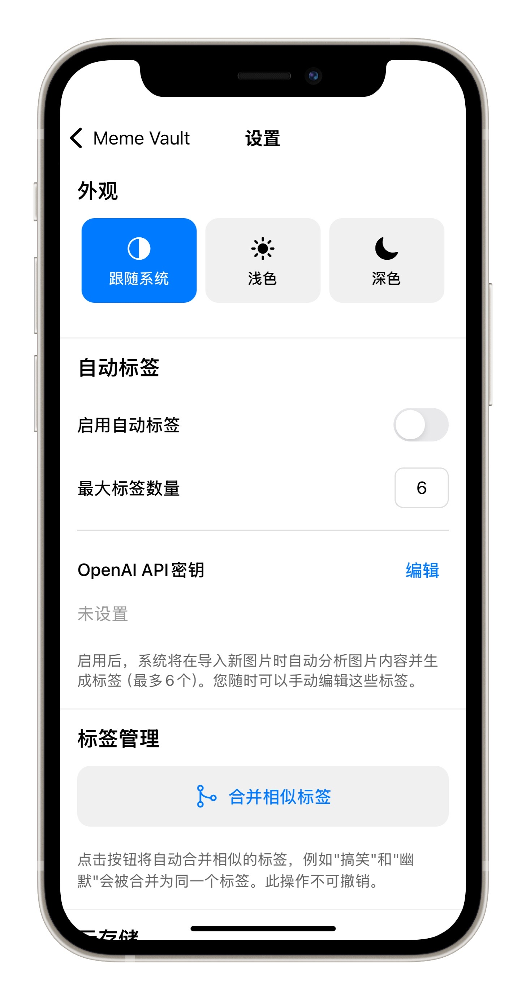
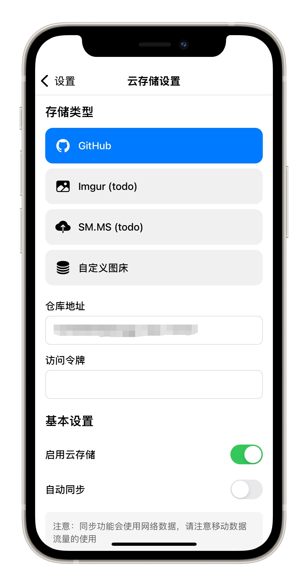

<p align="center">
  
</p>

<h1 align="center">MemeVault 表情包仓库</h1>

<p align="center">
  <strong>🏆 早期预览阶段，施工中... 🏆</strong>
</p>

<p align="center">
  
  
  
  
</p>

## 📱 简介

MemeVault 是一款功能强大的表情包管理应用，因为ios18逆天的相册设计 (only apple can do)，让我的表情包管理变得异常困难，故开发此应用（其实是我懒）。
## ✨ 主要功能

- **🖼️ 表情包管理**：轻松导入、分类和管理您的表情包收藏
- **🏷️ 智能标签**：通过视觉模型为表情包添加自定义标签，实现快速检索
- **🔍 快速搜索**：通过标签或关键词迅速找到需要的表情包
- **☁️ 云端同步**：将您的表情包安全地备份到云端，多设备无缝使用
- **👆 上划快捷分享**：通过上划手势快速分享您喜爱的表情包
- **🌓 深色模式**：支持浅色/深色主题切换
- **📊 使用统计**：查看您最常用的表情包和标签分析


## 🛠️ 技术栈

- **React Native**：跨平台移动应用开发框架
- **Expo**：简化React Native开发的工具集
- **Firebase**：提供云存储和数据同步功能
- **TypeScript**：增强代码可维护性的静态类型系统

## 📥 安装与使用

### 前提条件

- Node.js (v14.0.0+)
- npm
- iOS/Android 开发环境（如需本地运行）

### 安装步骤

1. 克隆仓库
```bash
git clone https://github.com/0x1DA9430/MemeVault.git
cd MemeVault
```

2. 安装依赖
```bash
npm install
```

3. 启动应用
```bash
npm start
# 或 expo go
npx expo start --clear
```

4. 在模拟器或真机上运行
```bash
# iOS
npm run ios
# Android
npm run android
```

## 截图

<p align="center">
  
  
</p>

<p align="center">
  
  
</p>

## TODO (不知要到猴年马月系列)

- 批量云同步(例如30张图一个batch)
- 统计功能（标签使用分析、总览）显示异常
- 图片排序功能，新添加的图片排最前
- 选更便宜的视觉模型，自动添加标签（目前默认是gpt4o-mini）
- 图片云存储，支持多个云存储服务商
- 分享时多文件类型支持（目前仅支持jpeg）
- ios右上角设置图标显示不全
- 优化图片加载性能
- 优化去重算法
- 优化大批量图片导入速度
- Android 端UI显示bug
